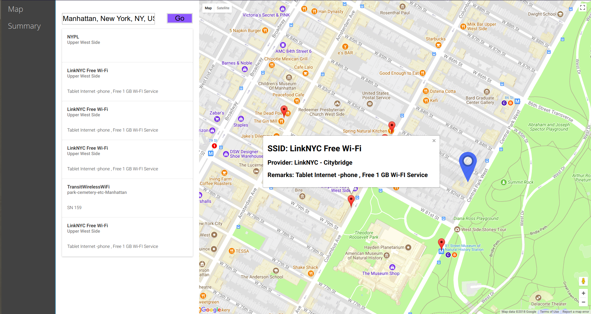

# **Database-Project-WiFi-Hotspots**
### Purpose
* Develop a better way of finding free public WiFi connection which takes advantage of Open Data
### Challenges
* Filtering out multiple datapoints for the same coordinates
### Result
* Was able to identify punlic WiFi locations in NYC which were not previously detectable
#### **Home Page With Results**

